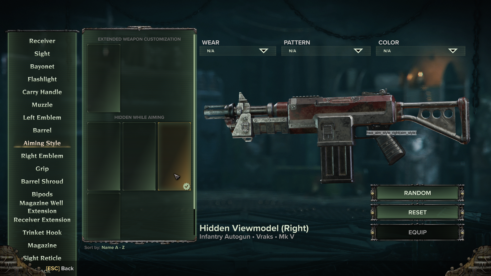
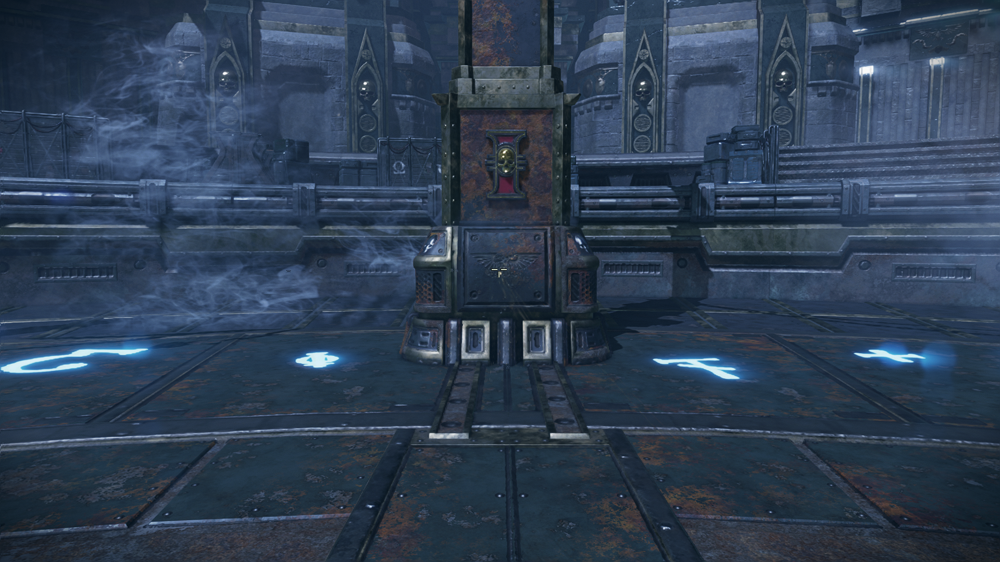

This plugin adds attachments to Extended Weapon Customization (EWC) to hide the viewmodel while using the secondary action, allowing for a clear view of the enemies on screen. We don't have `r_drawviewmodel 0` in Darktide, so this will do.

# Requirements and Installation
1. Extended Weapon Customization
    - Hosted in the [Darktide Modders Discord](https://discord.gg/rKYWtaDx4D) server, where it's pinned in the *#weapon-customization-mod* channel
    - The file is named `extended_weapon_customization.zip`. Be sure to check the FAQ in the other pins for more info (including requirements for EWC).
    - The Nexus page is hidden and the GitHub repository is not updated (as of writing 2026-04-29). Unfortunately, Discord is the only publicly available option.
2. [Crosshair Remap (Continued)](https://www.nexusmods.com/warhammer40kdarktide/mods/253)
    - Not a hard requirement, but highly recommended so there's a crosshair while you aim
3. This mod
    - [GitHub releases](https://github.com/Backup158/DarktideWeaponCustomizationNoGun/releases/latest)
    - Will be uploaded to Nexus when EWC is back on Nexus
For best results, load this mod *before* EWC! It won't if put after; it'll just fail with some sights from the main mod.

Load order with Crosshair Remap doesn't matter.

Install everything using whichever method you prefer. If you don't have one, refer to the [Darktide manual mod installation guide](https://dmf-docs.darkti.de/#/installing-mods).

# Usage
In the EWC customization menu for the weapon, select one of these options in the "Aiming Style" slot. There are three options: centered aim, left leaning, and right leaning. The weapon will still be off screen, but the bullet trails will come from those locations.

Aim.

Currently (v1.0.0), this only works with sights from Extended Weapon Customization. Equipping sights from other plugins may not work.

This only hides the weapon while aiming. It doesn't add crosshairs, so you'll be shooting blind unless you use another mod, such as Crosshair Remap (Continued).

# Alternatives
There are alternatives which do not require EWC. I won't promise that this list is up-to-date, but I'll leave it here in case it helps.
- [Cameleoline](https://www.nexusmods.com/warhammer40kdarktide/mods/495)
- [ViewModelTweaker](https://www.nexusmods.com/warhammer40kdarktide/mods/628)

# Contact
I prefer to keep things on Nexus, but while EWC is gone, I'll use D\*scord instead.
- [Thread](https://discord.com/channels/1048312349867646996/1423567934789521492) in the Darktide Modders Discord
- You can also just talk about it in the *#weapon-customization-channel*